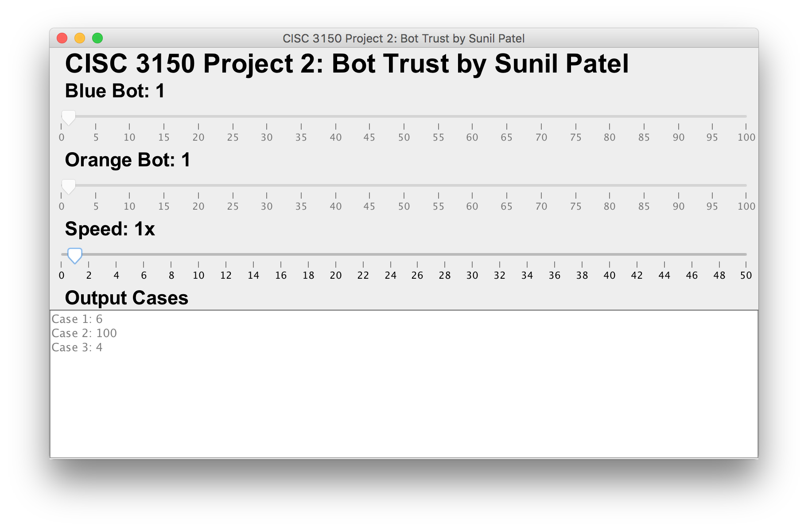

# Google Code Jam: Bot Trust

[Submission/Project Link](https://code.google.com/codejam/contest/975485/dashboard)

## Problem
Blue and Orange are friendly robots. An evil computer mastermind has locked them up in separate hallways to test them, and then possibly give them cake.

Each hallway contains 100 buttons labeled with the positive integers `{1, 2, ..., 100}`. Button `k` is always `k` meters from the start of the hallway, and the robots both begin at button 1. Over the period of one second, a robot can walk one meter in either direction, or it can press the button at its position once, or it can stay at its position and not press the button. To complete the test, the robots need to push a certain sequence of buttons in a certain order. Both robots know the full sequence in advance. How fast can they complete it?

For example, let's consider the following button sequence:
```
  O 2, B 1, B 2, O 4
```
Here, `O 2` means button 2 in Orange's hallway, `B 1` means button 1 in Blue's hallway, and so on. The robots can push this sequence of buttons in 6 seconds using the strategy shown below:

|Time | Orange           | Blue             |
|-----|------------------|------------------|
|  1  | Move to button 2 | Stay at button 1 |
|  2  | Push button 2    | Stay at button 1 |
|  3  | Move to button 3 | Push button 1    |
|  4  | Move to button 4 | Move to button 2 |
|  5  | Stay at button 4 | Push button 2    |
|  6  | Push button 4    | Stay at button 2 |

Note that Blue has to wait until Orange has completely finished pushing `O 2` before it can start pushing `B 1`.

## Input
The first line of the input gives the number of test cases, `T`. `T` test cases follow.

Each test case consists of a single line beginning with a positive integer `N`, representing the number of buttons that need to be pressed. This is followed by `N` terms of the form "`Ri Pi`" where `Ri` is a robot color (always 'O' or 'B'), and `Pi` is a button position.

## Output
For each test case, output one line containing "Case #x: y", where `x` is the case number (starting from 1) and `y` is the minimum number of seconds required for the robots to push the given buttons, in order.

**Limits**

1 ≤ **Pi** ≤ 100 for all i.

**Small dataset**

1 ≤ **T** ≤ 20.
1 ≤ **N** ≤ 10.

**Large dataset**

1 ≤ **T** ≤ 100.
1 ≤ **N** ≤ 100.

## Sample

```
Input               Output
3
4 O 2 B 1 B 2 O 4   Case #1: 6
3 O 5 O 8 B 100     Case #2: 100
2 B 2 B 1           Case #3: 4
```

## Solution



**Files**

* [BotTrust.java](BotTrust.java)
* [core/Config.java](core/Config.java)
* [core/Bot.java](core/Bot.java)
* [core/Gui.java](core/Gui.java)
* [core/CodeJam.java](core/CodeJam.java)

**Dataset**

* Small [A-small-practice.in](A-small-practice.in)
* Large [A-large-practice.in](A-large-practice.in)


## Run Project using Terminal
```sh
javac BotTrust.java
java BotTrust < A-small-practice.in > A-small-practice.out
```
